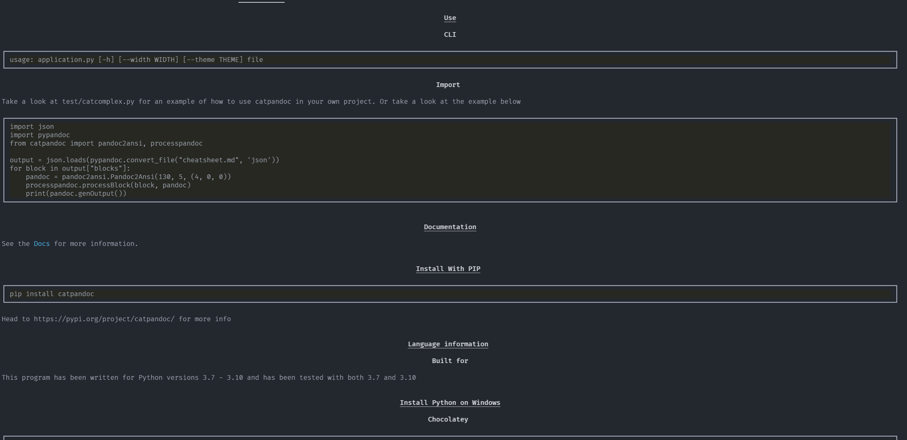

[](../../)
[](https://www.codacy.com/manual/FHPythonUtils/CatPandoc)
[](../../)
[](../../issues)
[](/LICENSE.md)
[](../../commits/master)
[](../../commits/master)
[](https://pypi.org/project/catpandoc/)
[](https://pypi.org/project/catpandoc/)

<!-- omit in toc -->
# CatPandoc


Cat multiple documents to the terminal. The continuation of CatMD

- [Features](#features)
	- [Document Compatability](#document-compatability)
	- [Terminal 'rendering'](#terminal-rendering)
- [Roadmap](#roadmap)
- [Install With PIP](#install-with-pip)
- [Use](#use)
	- [CLI](#cli)
	- [Import](#import)
- [Language information](#language-information)
	- [Built for](#built-for)
- [Install Python on Windows](#install-python-on-windows)
	- [Chocolatey](#chocolatey)
	- [Download](#download)
- [Install Python on Linux](#install-python-on-linux)
	- [Apt](#apt)
- [How to run](#how-to-run)
	- [With VSCode](#with-vscode)
	- [From the Terminal](#from-the-terminal)
- [Changelog](#changelog)
- [Download](#download-1)
	- [Clone](#clone)
		- [Using The Command Line](#using-the-command-line)
		- [Using GitHub Desktop](#using-github-desktop)
	- [Download Zip File](#download-zip-file)
- [Licence](#licence)
- [Screenshots](#screenshots)
	- [Desktop](#desktop)
	- [Themes](#themes)

## Features

### Document Compatability
Lightweight markup formats
- Markdown (including CommonMark and GitHub-flavored Markdown)
- reStructuredText
- Emacs Org-Mode
- Emacs Muse
- Textile
- txt2tags

HTML formats
- (X)HTML 4
- HTML5

Ebooks
- EPUB version 2 or 3
- FictionBook2

Documentation formats
- Haddock markup

Roff formats
- roff man

TeX formats
- LaTeX

XML formats
- DocBook version 4 or 5
- JATS

Outline formats
- OPML

Data formats
- CSV tables

Word processor formats
- Microsoft Word docx
- OpenOffice/LibreOffice ODT

Interactive notebook formats
- Jupyter notebook (ipynb)


Wiki markup formats
- MediaWiki markup
- DokuWiki markup
- TikiWiki markup
- TWiki markup
- Jira wiki markup

### Terminal 'rendering'
Highlights the following:
- Headers 1-6
- Unordered and ordered lists
- Block quotes
- Bold, Italic, Strikethrough, inline code
- Line Break (br)

Renders the following
- Tables
- Images (uses catimage for this so they can look a bit blurry...)

Higlights code blocks
- Uses pygments for code syntax highlighting

## Roadmap
For completed components, see the changelog (link below)

|Feature|Description|Status|
|---|---|---|
|pandoc2pysimplegui.py|Generate PySimpleGUI widgets|-|

## Install With PIP

```python
pip install catpandoc
```

Head to https://pypi.org/project/catpandoc/ for more info


## Use

### CLI
```bash
usage: application.py [-h] [--width WIDTH] [--theme THEME] file
```

### Import
Take a look at test/catcomplex.py for an example of how to use catpandoc in your own
project. Or take a look at the example below
```python
import json
import pypandoc
from catpandoc import pandoc2ansi, processpandoc

output = json.loads(pypandoc.convert_file("cheatsheet.md", 'json'))
for block in output["blocks"]:
	pandoc = pandoc2ansi.Pandoc2Ansi(130, 5, (4, 0, 0))
	processpandoc.processBlock(block, pandoc)
	print(pandoc.genOutput())
```


## Language information
### Built for
This program has been written for Python 3 and has been tested with
Python version 3.8.0 <https://www.python.org/downloads/release/python-380/>.

## Install Python on Windows
### Chocolatey
```powershell
choco install python
```
### Download
To install Python, go to <https://www.python.org/> and download the latest
version.

## Install Python on Linux
### Apt
```bash
sudo apt install python3.8
```

## How to run
### With VSCode
1. Open the .py file in vscode
2. Ensure a python 3.8 interpreter is selected (Ctrl+Shift+P > Python:Select
Interpreter > Python 3.8)
3. Run by pressing Ctrl+F5 (if you are prompted to install any modules, accept)
### From the Terminal
```bash
./[file].py
```


## Changelog
See the [CHANGELOG](/CHANGELOG.md) for more information.


## Download
### Clone
#### Using The Command Line
1. Press the Clone or download button in the top right
2. Copy the URL (link)
3. Open the command line and change directory to where you wish to
clone to
4. Type 'git clone' followed by URL in step 2
```bash
$ git clone https://github.com/FHPythonUtils/CatPandoc
```

More information can be found at
<https://help.github.com/en/articles/cloning-a-repository>

#### Using GitHub Desktop
1. Press the Clone or download button in the top right
2. Click open in desktop
3. Choose the path for where you want and click Clone

More information can be found at
<https://help.github.com/en/desktop/contributing-to-projects/cloning-a-repository-from-github-to-github-desktop>

### Download Zip File

1. Download this GitHub repository
2. Extract the zip archive
3. Copy/ move to the desired location


## Licence
MIT License
Copyright (c) FredHappyface
(See the [LICENSE](/LICENSE.md) for more information.)


## Screenshots

### Desktop
<div>



</div>

### Themes

<div>


</div>
